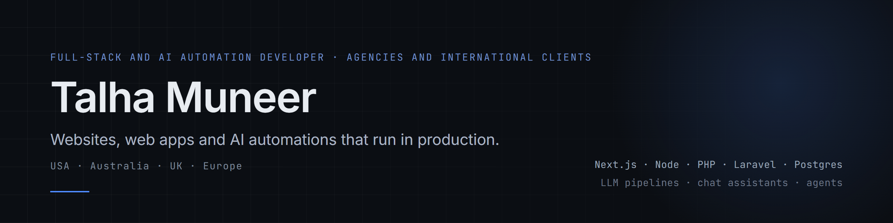

I build and ship production websites, web apps and AI automations for agencies that need a reliable overflow or white-label developer, and for clients of every size, from small businesses to large international firms. My clients are in the United States, Australia, the United Kingdom and across Europe. Next.js, Node, PHP and Laravel, WordPress, Shopify, Webflow.

## AI and automation

Most AI demos stop at the chat box. I build the part after it: the queue, the retries, the cost limits, the fallbacks, and the hand-off to a person or a CRM, so the automation keeps working when nobody is watching it.

- **Multi-model pipelines.** The [Rizing Growth OS](https://github.com/talha55/case-studies/blob/main/rizing-growth-os.md) audit engine asks ChatGPT, Gemini and Perplexity how they describe a business, combines that with crawl and Google data, and turns it into a scored report. It runs unattended on a job queue, and one failed provider gives a partial report, not a failed one.
- **Assistants that know the business.** Chat assistants on client sites such as [ATLANTA INK](https://github.com/talha55/case-studies/blob/main/atlanta-ink.md) and [Affordable Patio Covers](https://github.com/talha55/case-studies/blob/main/affordable-patio-covers.md) answer only from the site's own content, follow written rules about what they may not promise, and pass a qualified lead to the owner's inbox.
- **Lead and reporting automation.** Leads flow from forms and chat into email and CRM, and reports are generated, stored and delivered without a person in the loop.
- **Built to be trusted.** Rate limits, input caps, server-side keys, labelled assistants that never pose as a person, and tests around the parts that touch money or customers.

## Selected work

<table>
<tr>
<td width="50%" valign="top">
<a href="https://audit.rizingmetrics.com">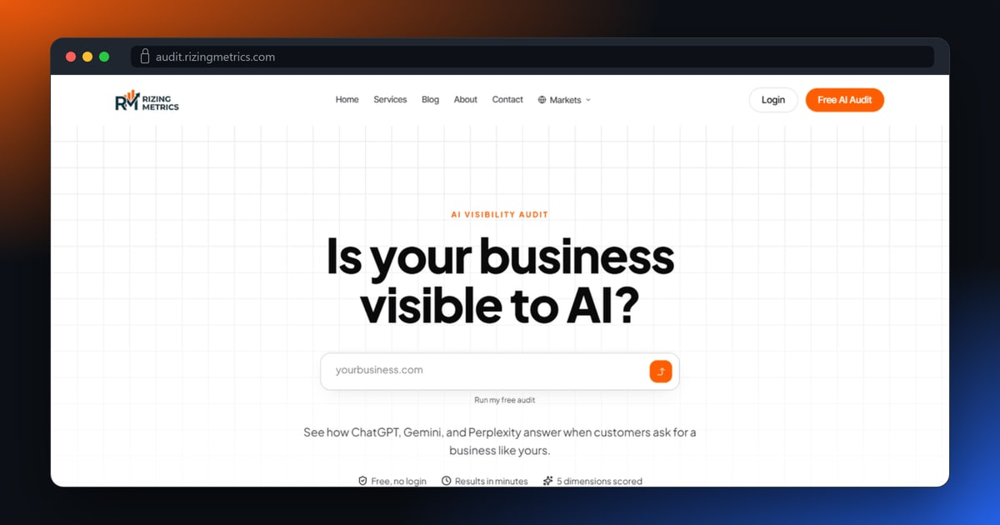</a> 
<b>Rizing Growth OS</b> 
AI website-audit SaaS: NestJS API, Postgres, staging and production on DigitalOcean, Next.js front end on Vercel. 
<a href="https://github.com/talha55/case-studies/blob/main/rizing-growth-os.md">Case study</a> · <a href="https://audit.rizingmetrics.com">Live</a>
</td>
<td width="50%" valign="top">
<a href="https://viewre.com.au">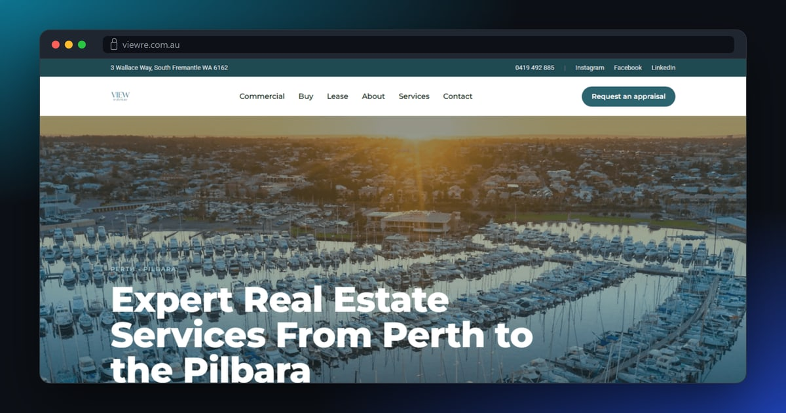</a> 
<b>View Real Estate</b> 
Real-estate agency site with listings synced from the Reapit CRM via a REAXML feed, built in Laravel for shared hosting. 
<a href="https://github.com/talha55/case-studies/blob/main/view-real-estate.md">Case study</a> · <a href="https://viewre.com.au">Live</a>
</td>
</tr>
<tr>
<td width="50%" valign="top">
<a href="https://www.atlantaink.com">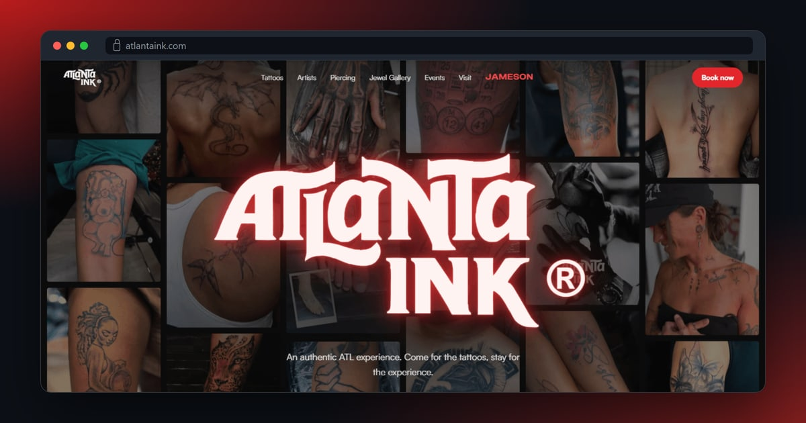</a> 
<b>ATLANTA INK</b> 
Brand-led Next.js site for a tattoo studio plus a standalone voucher-booking app with its own admin calendar. 
<a href="https://github.com/talha55/case-studies/blob/main/atlanta-ink.md">Case study</a> · <a href="https://www.atlantaink.com">Live</a>
</td>
<td width="50%" valign="top">
<a href="https://www.mowgreengrass.com">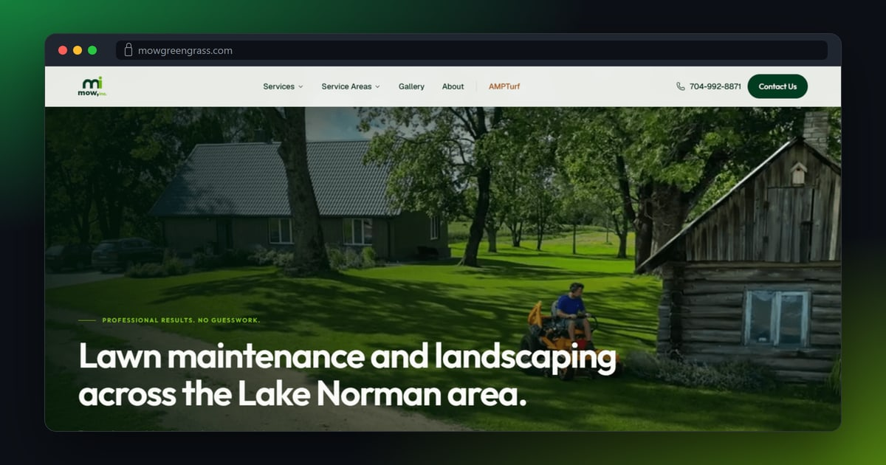</a> 
<b>Mow, Inc. and AMPTurf</b> 
Two lawn-care brands split into two Next.js sites with shared tooling and strict brand separation. 
<a href="https://github.com/talha55/case-studies/blob/main/mow-ampturf.md">Case study</a> · <a href="https://www.mowgreengrass.com">Live</a>
</td>
</tr>
<tr>
<td width="50%" valign="top">
<a href="https://www.daveandbusters.au">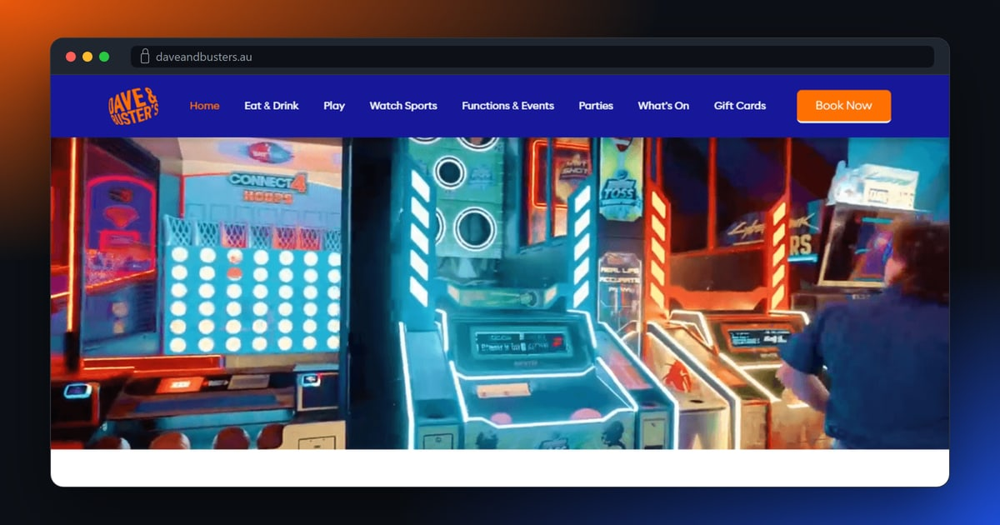</a> 
<b>Dave &amp; Buster's Perth</b> 
Webflow site for the entertainment venue: dining, arcade, sport, functions, bookings and gift cards. 
<a href="https://github.com/talha55/case-studies/blob/main/dave-and-busters.md">Case study</a> · <a href="https://www.daveandbusters.au">Live</a>
</td>
<td width="50%" valign="top">
<a href="https://teysha.com.au">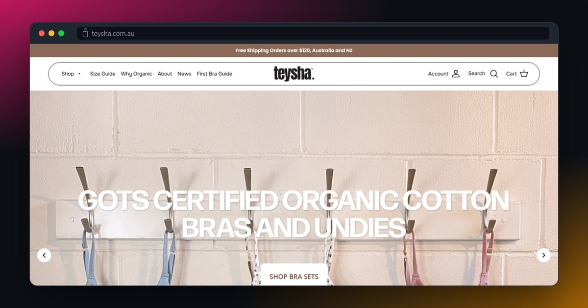</a> 
<b>Teysha</b> 
Shopify store for an organic cotton clothing brand, with collections, a product quiz and a size guide. 
<a href="https://github.com/talha55/case-studies/blob/main/teysha.md">Case study</a> · <a href="https://teysha.com.au">Live</a>
</td>
</tr>
<tr>
<td width="50%" valign="top">
<a href="https://www.medvieweducation.org">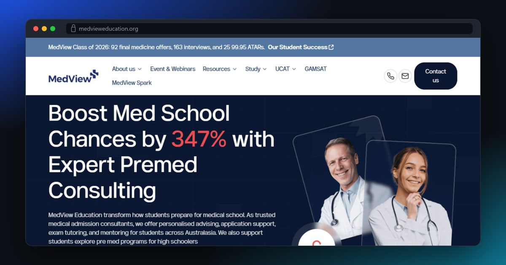</a> 
<b>MedView Education</b> 
Large Webflow CMS site for a medical admissions coaching company: programs, events and a resource library. 
<a href="https://github.com/talha55/case-studies/blob/main/medview-education.md">Case study</a> · <a href="https://www.medvieweducation.org">Live</a>
</td>
<td width="50%" valign="top">
<a href="https://heritagefinance.com.au">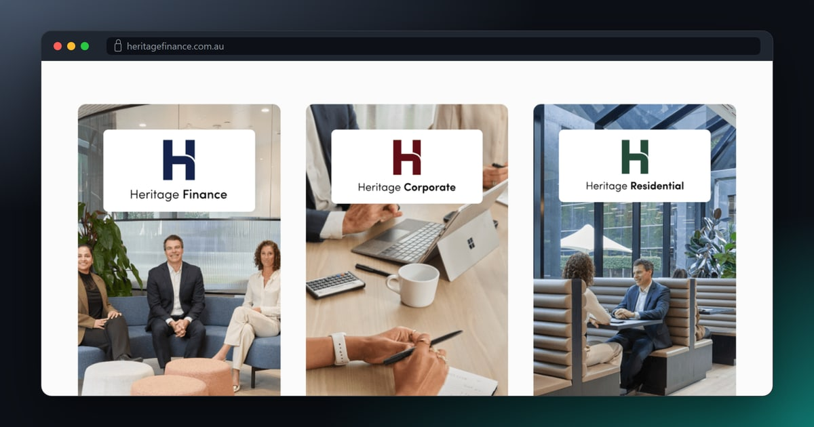</a> 
<b>Heritage Finance</b> 
WordPress site for a finance group, with a gateway home page and a section for each of three divisions. 
<a href="https://github.com/talha55/case-studies/blob/main/heritage-finance.md">Case study</a> · <a href="https://heritagefinance.com.au">Live</a>
</td>
</tr>
</table>

More than twenty projects are in the [case studies repo](https://github.com/talha55/case-studies), across custom Next.js and Laravel builds, Webflow, Shopify and WordPress, plus a WordPress security cleanup across several sites.

## Open source

<table>
<tr>
<td width="50%" valign="top">
<a href="https://github.com/talha55/ui-design-skill">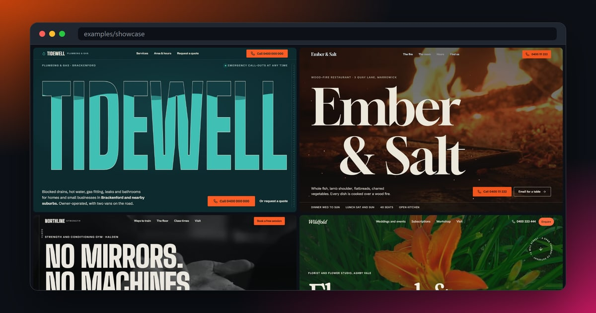</a> 
<b><a href="https://github.com/talha55/ui-design-skill">ui-design-skill</a></b>&nbsp;

 
A Claude skill that designs and builds bold, animated marketing sites: one strong idea, scroll and pointer animation with Motion, verified photos and video, and nothing invented about the business.
</td>
<td width="50%" valign="top">
<a href="https://github.com/talha55/next-chatbot-kit">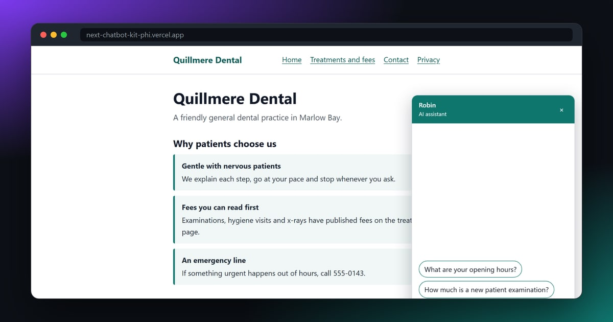</a> 
<b><a href="https://github.com/talha55/next-chatbot-kit">next-chatbot-kit</a></b>&nbsp;
 
Copyable Next.js chat assistant for small-business sites. It answers from the content you write, captures leads by email or webhook, and has guard rails against abuse and invented answers. <a href="https://next-chatbot-kit-phi.vercel.app">Live demo</a>
</td>
</tr>
<tr>
<td width="50%" valign="top">
<a href="https://github.com/talha55/site-audit-cli">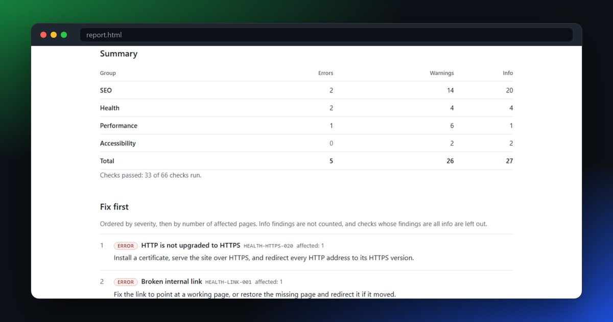</a> 
<b><a href="https://github.com/talha55/site-audit-cli">site-audit-cli</a></b>&nbsp;

 
Site audit with 69 checks for SEO, health, performance and accessibility. A polite crawler, a fix for every finding, no score, and a self-contained HTML report to hand to a client.
</td>
<td width="50%" valign="top">
<a href="https://github.com/talha55/wp-malware-scan">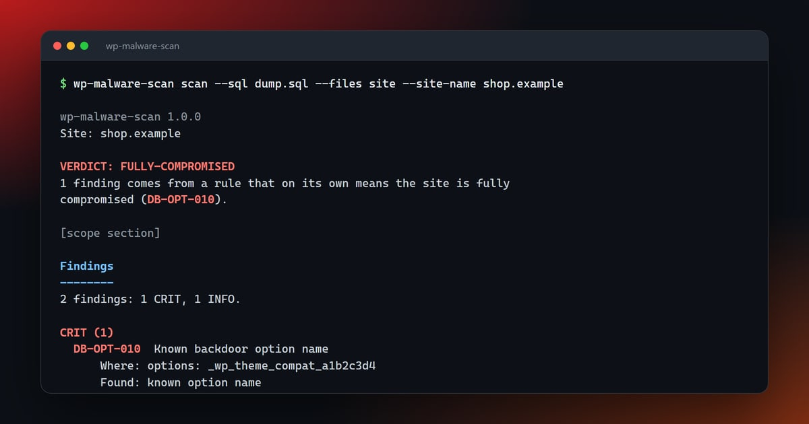</a> 
<b><a href="https://github.com/talha55/wp-malware-scan">wp-malware-scan</a></b>&nbsp;

 
Offline, read-only malware scanner for WordPress database dumps and site files, with no dependencies. A clear verdict, and a plain statement of anything it could not check.
</td>
</tr>
<tr>
<td width="50%" valign="top">
<a href="https://github.com/talha55/next-headless-starter">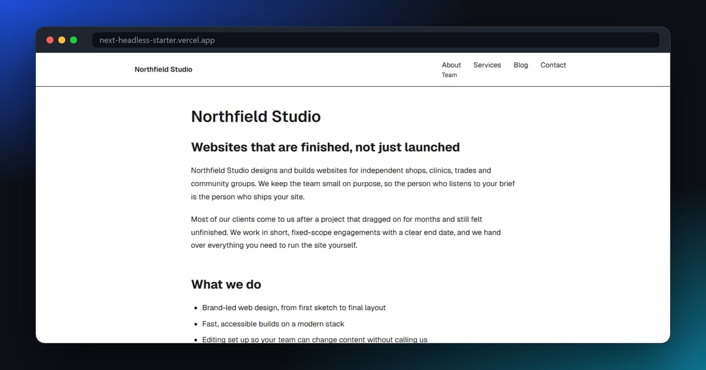</a> 
<b><a href="https://github.com/talha55/next-headless-starter">next-headless-starter</a></b>&nbsp;

 
Next.js 16 starter for headless WordPress: typed content layer, WPGraphQL adapter, editor preview, instant revalidation, SEO, and a Lighthouse budget in CI. <a href="https://next-headless-starter.vercel.app">Live demo</a>
</td>
<td width="50%" valign="top">
<a href="https://github.com/talha55/reaxml-parser">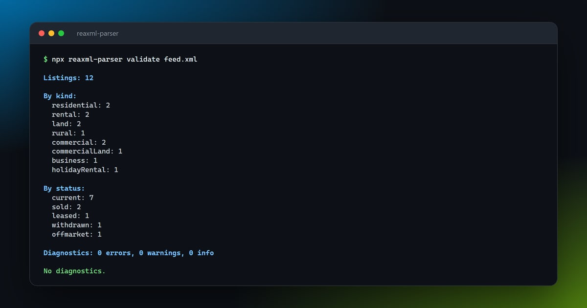</a> 
<b><a href="https://github.com/talha55/reaxml-parser">reaxml-parser</a></b>&nbsp;

 
TypeScript parser for REAXML real-estate feeds: typed, normalised listings, structured diagnostics for the traps real feeds contain, and a validate command-line tool.
</td>
</tr>
</table>

## Working with agencies

- White-label by default. Your name on the work, your client relationship, my code.
- Your repo or mine. I work inside your GitHub org and process when you have one.
- Daily async updates in writing. No surprises on Friday.
- Documented handoff on every project: README, environment notes, deploy steps, and a recorded walkthrough when it helps.
- Overlapping Australian and US hours, agreed per project.

## Stack

- Front end: Next.js, React, TypeScript, Tailwind
- Back end: Node, NestJS, PHP, Laravel, REST APIs
- AI: Claude, OpenAI, Gemini and Perplexity APIs, tool-calling agents, MCP integrations, queued LLM pipelines, site-grounded chat assistants
- Data: PostgreSQL, MySQL, MongoDB, Supabase
- CMS and commerce: WordPress, Shopify, Webflow
- Infrastructure: Vercel, DigitalOcean, Docker, Coolify, GitHub Actions, cPanel

## Contact

- Email: talha.tech01@gmail.com
- Website: https://www.talhamuneer.com
- LinkedIn: https://www.linkedin.com/in/talha-muneer/
