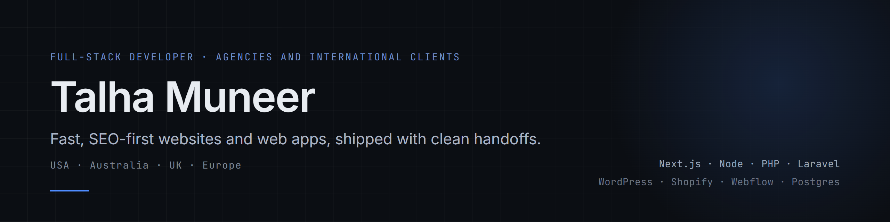

I build and ship production websites and web apps for agencies that need a reliable overflow or white-label developer, and for international clients and small businesses that want a site that brings in work. Current and past clients are in the United States and Australia. Next.js, Node, PHP and Laravel, WordPress, Shopify, Webflow.

## Selected work

<table>
<tr>
<td width="50%" valign="top">
 
<b>Rizing Growth OS</b> 
AI website-audit SaaS: NestJS API, Postgres, staging and production on DigitalOcean, Next.js front end on Vercel. 
<a href="https://github.com/talha55/case-studies/blob/main/rizing-growth-os.md">Case study</a> · <a href="https://audit.rizingmetrics.com">Live</a>
</td>
<td width="50%" valign="top">
 
<b>View Real Estate</b> 
Real-estate agency site with listings synced from the Reapit CRM via a REAXML feed, built in Laravel for shared hosting. 
<a href="https://github.com/talha55/case-studies/blob/main/view-real-estate.md">Case study</a> · <a href="https://viewre.com.au">Live</a>
</td>
</tr>
<tr>
<td width="50%" valign="top">
 
<b>ATLANTA INK</b> 
Brand-led Next.js site for a tattoo studio plus a standalone voucher-booking app with its own admin calendar. 
<a href="https://github.com/talha55/case-studies/blob/main/atlanta-ink.md">Case study</a> · <a href="https://www.atlantaink.com">Live</a>
</td>
<td width="50%" valign="top">
 
<b>Mow, Inc. and AMPTurf</b> 
Two lawn-care brands split into two Next.js sites with shared tooling and strict brand separation. 
<a href="https://github.com/talha55/case-studies/blob/main/mow-ampturf.md">Case study</a> · <a href="https://www.mowgreengrass.com">Live</a>
</td>
</tr>
</table>

More in the [case studies repo](https://github.com/talha55/case-studies), including a WordPress security cleanup across several sites.

## Open source

| Project | What it is |
|---|---|
| [next-headless-starter](https://github.com/talha55/next-headless-starter) | Next.js 16 starter for headless WordPress: typed content layer, WPGraphQL adapter, editor preview, instant revalidation, SEO, tests, and a Lighthouse budget in CI. [Live demo](https://next-headless-starter.vercel.app) |
| [reaxml-parser](https://github.com/talha55/reaxml-parser) | TypeScript parser for REAXML real-estate feeds: typed listings, a normalising layer for the traps real feeds contain, structured diagnostics, and a validate command-line tool. |

## Working with agencies

- White-label by default. Your name on the work, your client relationship, my code.
- Your repo or mine. I work inside your GitHub org and process when you have one.
- Daily async updates in writing. No surprises on Friday.
- Documented handoff on every project: README, environment notes, deploy steps, and a recorded walkthrough when it helps.
- Overlapping Australian and US hours, agreed per project.

## Stack

- Front end: Next.js, React, TypeScript, Tailwind
- Back end: Node, NestJS, PHP, Laravel, REST APIs
- Data: PostgreSQL, MySQL, MongoDB, Supabase
- CMS and commerce: WordPress, Shopify, Webflow
- Infrastructure: Vercel, DigitalOcean, Docker, Coolify, GitHub Actions, cPanel

## Contact

- Email: talha.tech01@gmail.com
- Website: https://www.talhamuneer.com
- LinkedIn: https://www.linkedin.com/in/talha-muneer/
